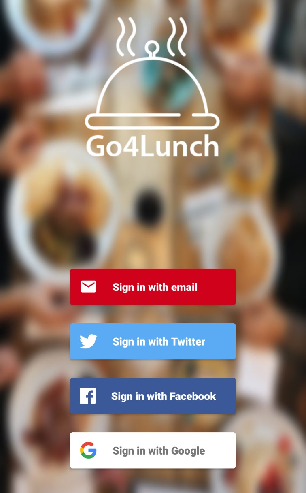
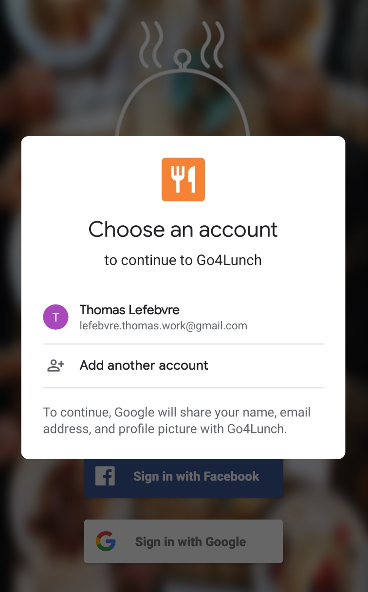
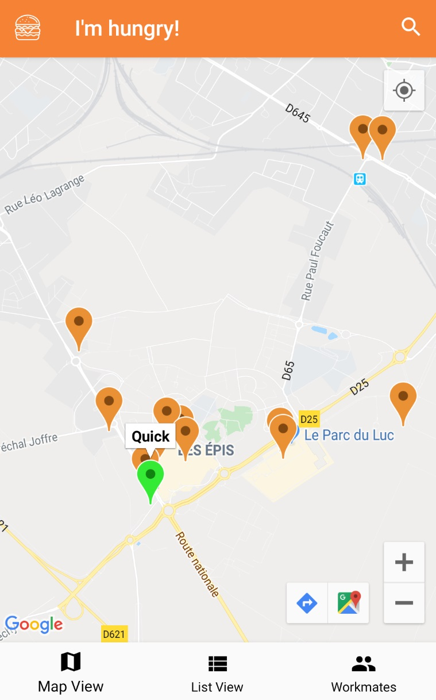
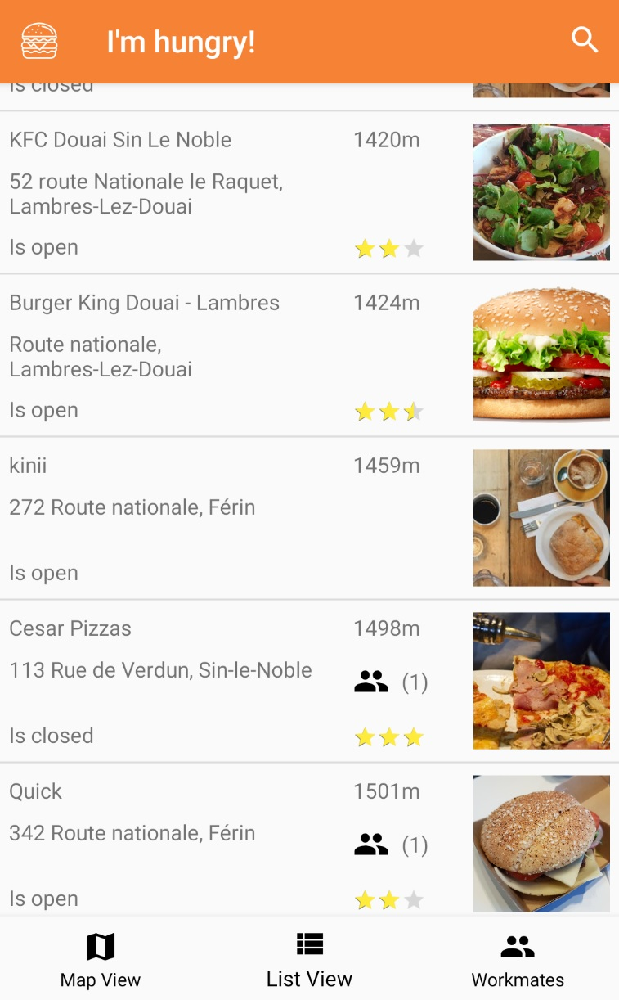
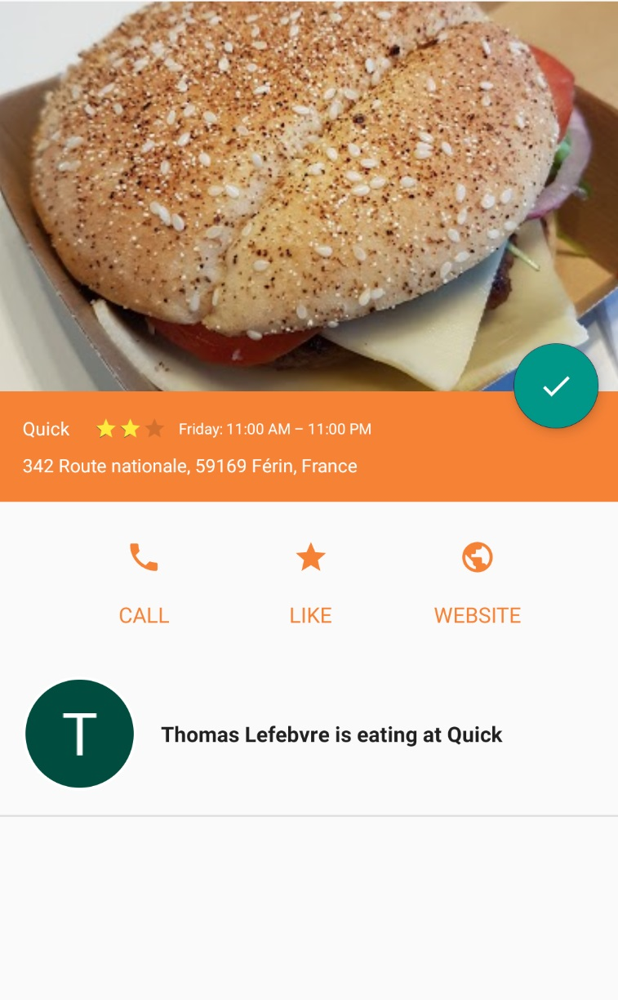
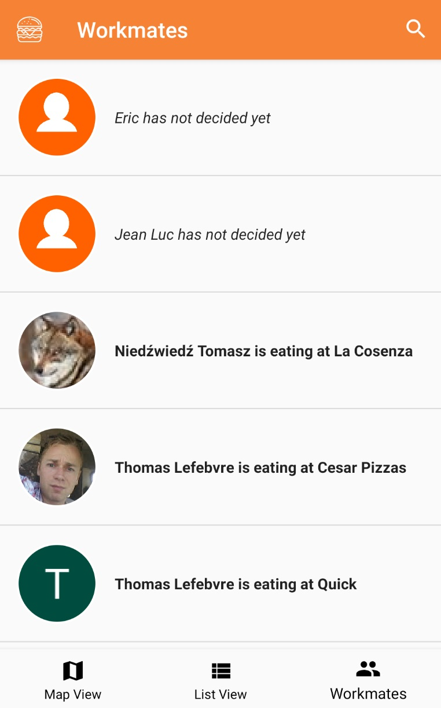
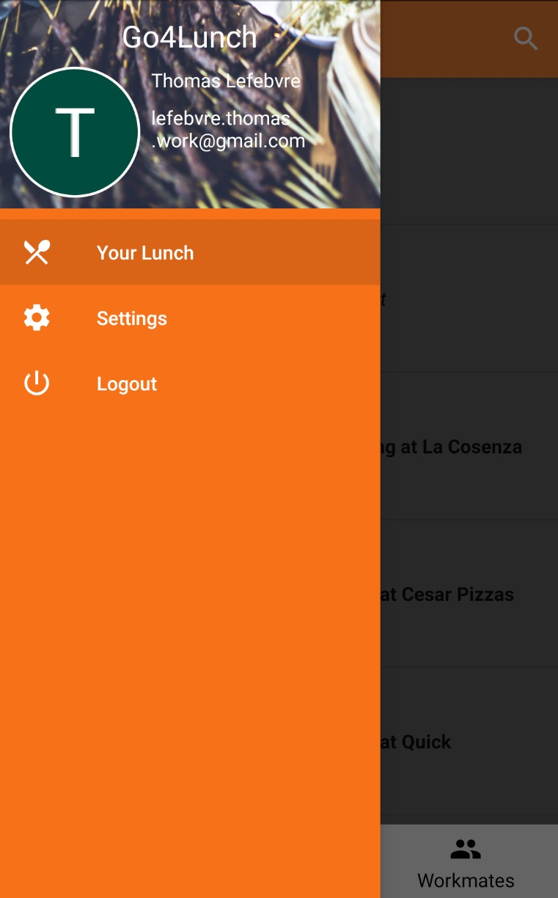

# Go4Lunch

An Android application that allows you to find a restaurant nearby, to eat with your colleagues.

This allows:
- Display the 20 closest restaurants, as a list or on a map
- Display restaurant information
- Display the list of colleagues and their choice of restaurants

## Phone display:
### Login screen

 

### Map

 

### Restaurants List

 

### Restaurants Détails

 

### Workmates List

### Menu Drawer

### Developed By LEFEBVRE Thomas

    Copyright 2019 TEKZ Dev
